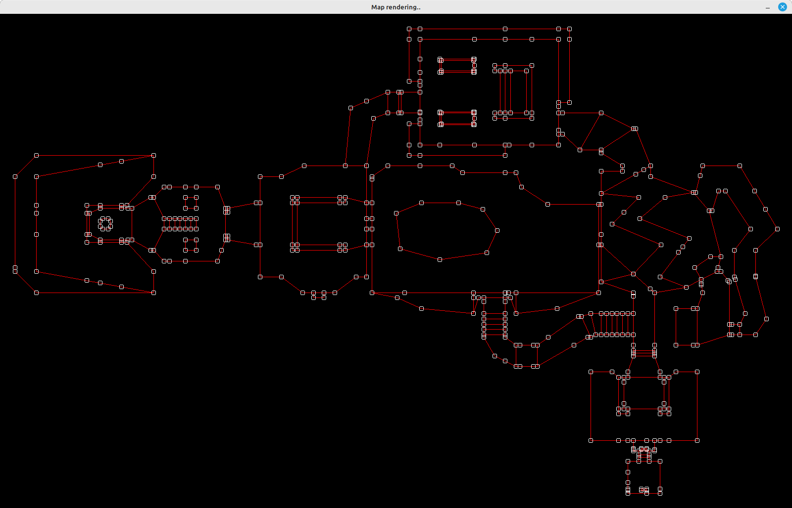

# WAD-reader
## A C program that lets you read a WAD file and displays the structure of the map accordingly.

### __What does it do ?__
- It takes a .WAD filepath as an input, reads it and attempts to display the result of what it just read, as a 2D map of points and linedefs (that represent the vertexes and linedefs that are part of the Doom structure of sectors and subsectors).
<br />

### __Requirements__

- C compiler (gcc or clang worked juste fine for me), and the standard lib that goes with it.
- SDL2 library. You can install it using :
```ps
sudo apt install libsdl2-dev
```


### __How to install it on your computer ?__

- Just clone it wherever you want in your computer, using : 
```ps
git clone https://github.com/Esteban795/WAD-reader.git
```

- When inside the folder, you can run 
```ps 
make all
```
to have the program display an example for you. If everything goes fine, you should get this on your screen : 



If it doesn't work for some reason, open an issue and I'll look into it as much as possible.

## __How to use it ?__

- From the folder, just 
```ps
make build
```

and then go ahead using either 

```ps
make run
```
to display a file example, or use 
```
./bin/wad_reader <yourfilepathhere>
```
if you prefer to use a custom file.
